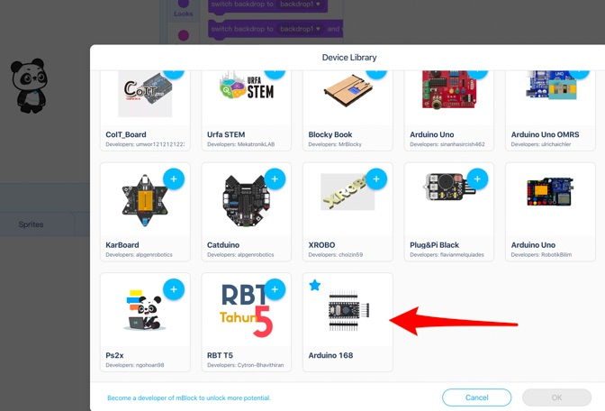

# How to add an Arduino device into [MakeBlock](https://www.makeblock.com/) IDE

This is an example for Atmega168.

## Hack boards.js

Edit `/Applications/Makeblock/mBlock.app/Contents/Resources/app/mlink-v1/platforms/arduino/boards.js`
Add the following section
```
    nano168: {
        args: "-mmcu=atmega168 -DF_CPU=16000000L -DARDUINO=10809 -DARDUINO_AVR_NANO -DARDUINO_ARCH_AVR",
        linkArgs: "-mmcu=atmega168",
        variants: "eightanaloginputs",
        staticLib: "libnano.a",
        rootDir: "nano"
    }
```

The full file will look like

```
module.exports={uno:{args:"-mmcu=atmega328p -DF_CPU=16000000L -DARDUINO=10605 -DARDUINO_AVR_UNO -DARDUINO_ARCH_AVR",linkArgs:"-mmcu=atmega328p",variants:"standard",staticLib:"libmbot.a",rootDir:"mbot"},mega:{args:"-mmcu=atmega2560 -DF_CPU=16000000L -DARDUINO=10605 -DARDUINO_AVR_MEGA2560 -DARDUINO_ARCH_AVR",linkArgs:"-mmcu=atmega2560",variants:"mega",staticLib:"libranger.a",rootDir:"ranger"},leonardo:{args:"-mmcu=atmega32u4 -DF_CPU=16000000L -DARDUINO=10605 -DARDUINO_AVR_LEONARDO -DARDUINO_ARCH_AVR",linkArgs:"-mmcu=atmega32u4",variants:"leonardo",staticLib:"libleonardo.a",rootDir:"leonardo"},micro:{args:"-mmcu=atmega32u4 -DF_CPU=16000000L -DARDUINO=10605 -DARDUINO_AVR_MICRO -DARDUINO_ARCH_AVR -DUSB_VID=0x2341 -DUSB_PID=0x8037",linkArgs:"-mmcu=atmega32u4",variants:"micro",staticLib:"libmicro.a",rootDir:"micro"},yun:{args:"-mmcu=atmega32u4 -DF_CPU=16000000L -DARDUINO=10605 -DARDUINO_AVR_YUN -DARDUINO_ARCH_AVR -DUSB_VID=0x2341 -DUSB_PID=0x8041",linkArgs:"-mmcu=atmega32u4",variants:"yun",staticLib:"libyun.a",rootDir:"yun"},nano:{args:"-mmcu=atmega328p -DF_CPU=16000000L -DARDUINO=10809 -DARDUINO_AVR_NANO -DARDUINO_ARCH_AVR",linkArgs:"-mmcu=atmega328p",variants:"eightanaloginputs",staticLib:"libnano.a",rootDir:"nano"},nano168:{args:"-mmcu=atmega168 -DF_CPU=16000000L -DARDUINO=10809 -DARDUINO_AVR_NANO -DARDUINO_ARCH_AVR",linkArgs:"-mmcu=atmega168",variants:"eightanaloginputs",staticLib:"libnano.a",rootDir:"nano"}};
```
Notice that the boardID is that we will be adding below is `nano168`.

## Install arduino_168 device

Download [arduino_168.mext](./arduino_168.mext) and install the new device by drag-n-dropping it into mBlock IDE window. You should see a new folder `$HOME/mblock/exts/arduino_168`
Note that deviceID is `arduino_168`. You can unzip `arduino_168.mext` and look inside `index.js`

The same way you configure your own device in https://ext.mblock.cc/. Either create a device from scratch (see official documentation) or tweak an existing one. For tweaking you need to have a device in `.mext` file. 

Example - download the [arduino_168.mext](./arduino_168.mext) click on "My device" in https://ext.mblock.cc, import the extension file. Edit it to your liking. Most critical parts are "Connection settings" -> "Connectivity settings" -> "baudRate" and "Basic information" -> "ID"
Give your device an unique ID. Note that this is the ID that C compiler and linker use to find command line arguments. Update `/Applications/Makeblock/mBlock.app/Contents/Resources/app/mlink-v1/platforms/arduino/boards.js` as needed. 
This is the same ID that extension files are mapped to. In other words, once you create a new device ID, you will need to create (copy) your own ecosystem of extension for it. Otherwise nothing will show up in the "Extension center"


Another examples to tweak

* [arduino nano](./arduino_nano_v0.1.3_abe46cba.mext) 
* [arduino uno](./arduino_uno_v0.4.9_0ea4da04.mext) 

Once you are done - click "Save" at the bottom and "Download" button on the top right. Download the extension file - `*.mext`. Install the new extension by drag-n-dropping it into mBlock IDE window. 

The new device shows up in the device library.



## Repack and install extensions for arduino_168

Every extension for mBlock5 is a zip archive with the `.mext` suffix. List of all available extensions can ve found at `$HOME/mblock/exts/ext.json`. Installed extensions (and devices) are folders in `$HOME/mblock/exts/`. 

Open `$HOME/mblock/exts/ext.json` and lookup .mext file URL for the extension you want. Download it. Open https://ext.mblock.cc/ , click on "My extension" and import the extension file. Click to edit the newly imported extension. Go to "Advanced configuration". Edit "Support device/sprite" section. Add new device - `arduino_168`. Remove all other devices. Click "Save" at the bottom and "Download" button on the top right. Download the extension file - `*.mext`. Install the new extension by drag-n-dropping it into mBlock IDE window. 

Repeat same steps for all other extensions.
 
